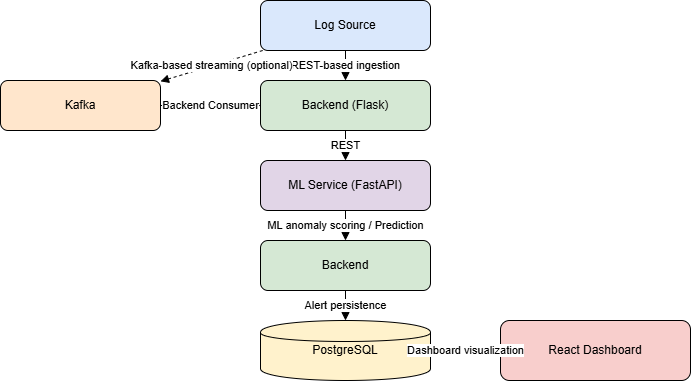

# AI-Enhanced Cybersecurity Threat Detector

An end-to-end cybersecurity system that detects anomalous activity from logs or network events using machine learning and stream processing.

The project supports both **local (REST)** and **streaming (Kafka)** execution modes.

---

## Architecture

### High-level flow

- Logs or events are ingested via REST or Kafka
- Backend processes events and calls the ML service
- ML service performs anomaly detection
- Security alerts are stored in PostgreSQL
- React dashboard visualizes alerts and severity

---

## Tech Stack

### Backend

- Python (Flask)
- Kafka (optional streaming)
- PostgreSQL

### ML Service

- Python (FastAPI)
- scikit-learn (Isolation Forest)
- NumPy, pandas

### Frontend

- React

### Infrastructure

- Docker
- Docker Compose (Kafka, Zookeeper, PostgreSQL)

---

## Project Structure

AI-Enhanced-Cybersecurity-Threat-Detector/
├── backend/ # Flask backend service
├── ml-service/ # FastAPI ML microservice
├── dashboard/ # React frontend
├── docker/ # Kafka, Zookeeper, PostgreSQL
├── datasets/ # Local datasets (not committed)
├── diagrams/ # Architecture diagrams
└── README.md

---

## Datasets

This project uses public datasets **only for local training**:

- CICIDS2017
- UNSW-NB15

Datasets are stored locally under `/datasets` and are **excluded from version control**.

---

## Running the Project (Local)

### 1. Start infrastructure

cd docker
docker compose up -d

### 2. Start ML service

cd ml-service
python -m uvicorn app.main:app --reload --port 8001

### 3. Start backend

cd backend
python app.py

### 4. Start dashboard

cd dashboard
npm install
npm start
