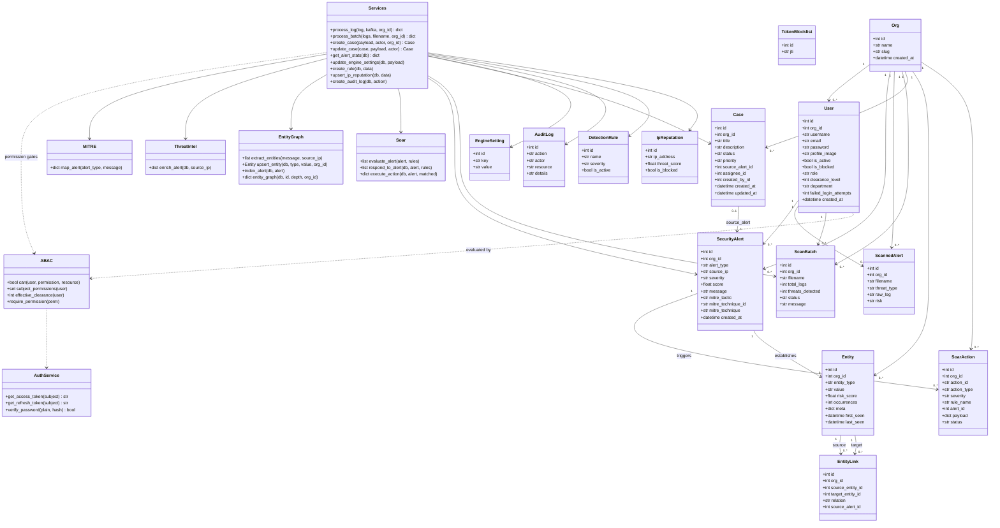

# Class Diagram — Backend Domain

> UML **Class Diagram** of the core backend classes (SQLAlchemy models + policy + services).

## Model mapping (SQLAlchemy → table)

| Class | Table | Notes |
| --- | --- | --- |
| `Org` | `orgs` | tenant; `slug` unique; `ensure_default_org` seeds `default` |
| `User` | `users` | ABAC subject attrs: `role`, `clearance_level`, `department`; FK → `orgs.id` |
| `SecurityAlert` | `security_alerts` | engine detections; FK → `users.id`, `orgs.id`; MITRE tactic/technique |
| `ScannedAlert` | `scanned_alerts` | per-finding evidence rows from uploaded log files; FK → `users.id`, `orgs.id` |
| `ScanBatch` | `scan_batches` | persisted upload history (filename, counts, status); FK → `users.id`, `orgs.id` |
| `Case` | `cases` | incident lifecycle (`open → triaging → resolved → closed`); FK → `orgs.id`, `security_alerts.id` |
| `Entity` | `entities` | attack-graph nodes; unique `(org_id, entity_type, value)` |
| `EntityLink` | `entity_links` | attack-graph edges; FK → `entities.id` (×2), `security_alerts.id` |
| `SoarAction` | `soar_actions` | automated-response audit; `action_id` unique; FK → `orgs.id`, `security_alerts.id` |
| `TokenBlocklist` | `token_blocklist` | JTI revocation on logout (no user FK by design) |
| `DetectionRule` | `detection_rules` | name-unique rules |
| `IpReputation` | `ip_reputation` | threat_score + blacklist |
| `EngineSetting` | `engine_settings` | key/value singletons |
| `AuditLog` | `audit_logs` | immutable admin/triage trail (actor is a snapshot string, no FK) |

## Service layer API surface (`backend/app/services/*`)

- `user_service.py` — `get_profile_data`, `update_user_profile_data`, `update_user_password`
- `alert_service.py` — `process_log`, `get_alert_stats`, `get_top_threats`
- `item_service.py` — engine settings CRUD, rules CRUD, IP reputation CRUD, `audit` wrapper
- `case_service.py` — `create_case`, `update_case`, `list_cases`, `get_case` (org-scoped)
- `mitre.py` — `map_alert` → MITRE ATT&CK tactic/technique
- `threat_intel.py` — `enrich_alert` → source-IP reputation context
- `entity_graph.py` — `extract_entities`, `upsert_entity`, `index_alert`, `entity_graph`
- `soar.py` — `evaluate_alert`, `respond_to_alert`, `execute_action`
- `ml_client.py` — `predict_network`, `predict_log`, batch variants (retry + heuristic fallback)
- `kafka_producer.py` / `kafka_consumer.py` — optional stream plumbing