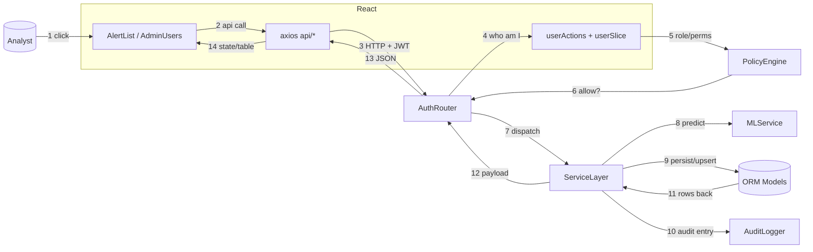

# Collaboration Diagram — SOC Workflow

> UML **Collaboration / Communication Diagram** showing how objects exchange
> messages during a SOC triage workflow (view alerts → act on a user).

## Message summary

| # | From → To | What travels |
| --- | --- | --- |
| 1 | Analyst → `AlertList` | row action (details / admin action) |
| 2 | `AlertList` → `api/*` | typed api call (alertsApi, userApi, auditApi, engineApi) |
| 3 | `api/*` → `AuthRouter` | authenticated HTTP request |
| 4 | `AuthRouter` → Redux | resolve current user + perms (via `/me` / cached slice) |
| 5 | Redux → `PolicyEngine` | `{role, clearance_level, department}` |
| 6 | `PolicyEngine` → `AuthRouter` | allow/deny per `require_permission` |
| 7 | `AuthRouter` → `ServiceLayer` | route handler → service function |
| 8 | `ServiceLayer` → ML | `/predict/{network,log}` request |
| 9 | `ServiceLayer` → ORM | CREATE/UPDATE table rows |
| 10 | `ServiceLayer` → `AuditLogger` | write `audit_logs` entry |
| 11 | ORM → `ServiceLayer` | flushed rows / query result |
| 12 | `ServiceLayer` → `AuthRouter` | serialized response payload |
| 13 | `AuthRouter` → `api/*` | JSON status + data |
| 14 | `api/*` → `AlertList` | query result → table/state update |

## Variants

- **Log upload (background)**: step 3 targets `/upload-logs`; step 7 persists a
  `ScanBatch` and returns immediately; steps 8–11 run in a `BackgroundTasks`
  worker keyed by `batch_id`, and step 12 includes the batch status which the
  SPA polls via `/uploads/{batch_id}`.
- **Manage user** (Admin): replaces steps 8–9 with `user_service` PATCH/block
  (no ML hop); step 10 still writes an audit entry.
- **Alerts export**: step 3 targets `/alerts/export`; step 9 absent; a CSV blob
  returns on step 13.