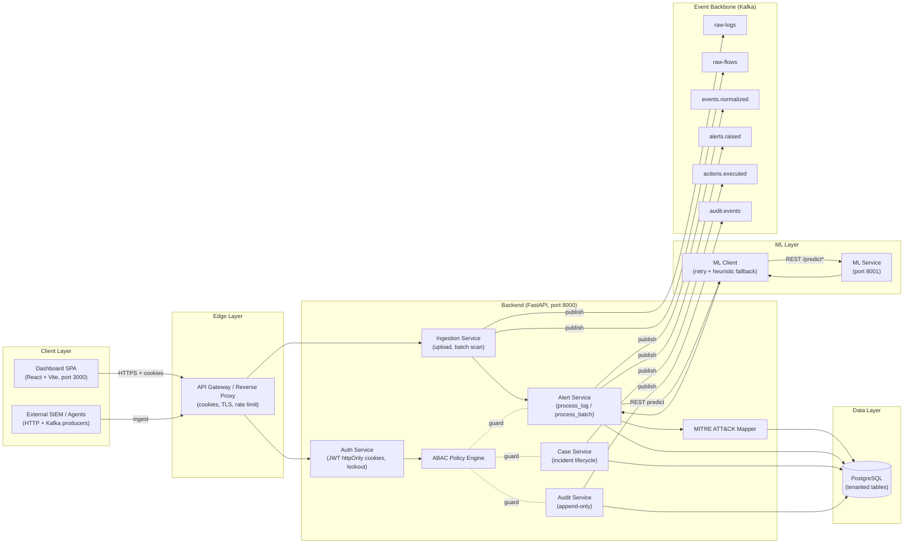

# Component Diagram — v3 Microservices

> UML **Component Diagram** (structural) showing how the v3 system is packaged
> into deployable components and the interfaces they expose / consume.
> Mirrors `target-architecture.md` at the component level (event-driven, K8s-ready).

## Component responsibilities

| Component | Key interfaces | Depends on |
| --- | --- | --- |
| Auth Service | `POST /login`, `/refresh`, `/logout`, `/register` | PostgreSQL, ABAC |
| Ingestion Service | `POST /upload-logs`, `GET /uploads/{id}` | Kafka (`raw-logs`, `raw-flows`), PostgreSQL |
| Alert Service | `POST /analyze`, `GET /alerts` | ML Client, MITRE mapper, Kafka, PostgreSQL |
| MITRE Mapper | `map_alert(alert_type, message)` → tactic/technique | none (static rules) |
| Case Service | `GET/POST /cases`, `PATCH /cases/{id}` | ABAC, PostgreSQL, Kafka (`actions.executed`) |
| Audit Service | `GET /audit-logs` | PostgreSQL, Kafka (`audit.events`) |
| ML Client | retry + heuristic fallback | ML Service |
| ML Service | `/predict/log`, `/predict/network` | trained models |

> **Current state (v3 Phase 1):** Auth, Ingestion, Alert, Case, Audit and the ML
> client/mapper are implemented in `backend/app`. Kafka publishing is wired via
> `kafka_producer.py` (topics `raw-logs` … `audit.events`); consuming services
> (SOAR, threat-intel, entity graph) are the next phase.
