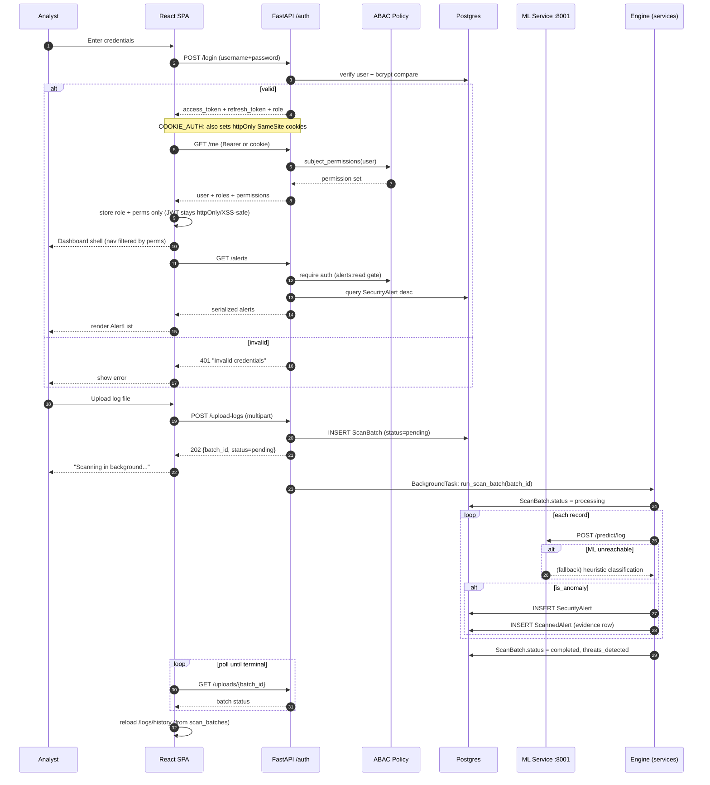

# Sequence Diagram — Login → Dashboard → Alert Ingest

> UML **Sequence Diagram**: two core flows —
> (A) authentication + dashboard bootstrap, and
> (B) log upload → ML prediction → alert persistence.

## Notes

- **Single source of truth is Postgres.** Every read (alerts, stats, history,
  audit) is a direct SQL query; there is no in-memory snapshot cache, so there
  is no risk of a multi-worker "cache divergence". Writes persist to Postgres
  and are immediately visible to all workers/processes.
- **Uploads are async.** `POST /upload-logs` returns immediately with a
  `batch_id`; the ML scan runs in a FastAPI `BackgroundTasks` worker and the
  dashboard polls `GET /uploads/{batch_id}` until the batch is `completed` or
  `failed`. Upload history is persisted in the `scan_batches` table.
- **Auth tokens.** `access_token`/`refresh_token` are short-lived JWTs issued
  on `/login` and re-issued by `/refresh`. With `COOKIE_AUTH` enabled the
  backend additionally stores them in httpOnly SameSite cookies (XSS-safe); the
  Bearer-header transport stays supported for API clients. `/me` returns the
  authenticated user's roles and ABAC permission set.
- **ML failure path.** If `POST /predict/log` errors, `ml_client` retries with
  backoff (2 attempts) then falls back to heuristic keyword/volume scoring, so
  the upload still completes and the result is tagged `fallback: true`.