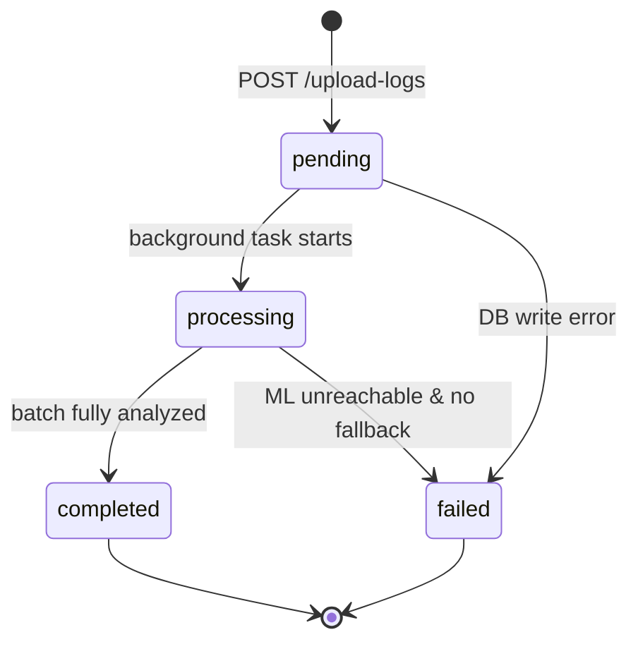
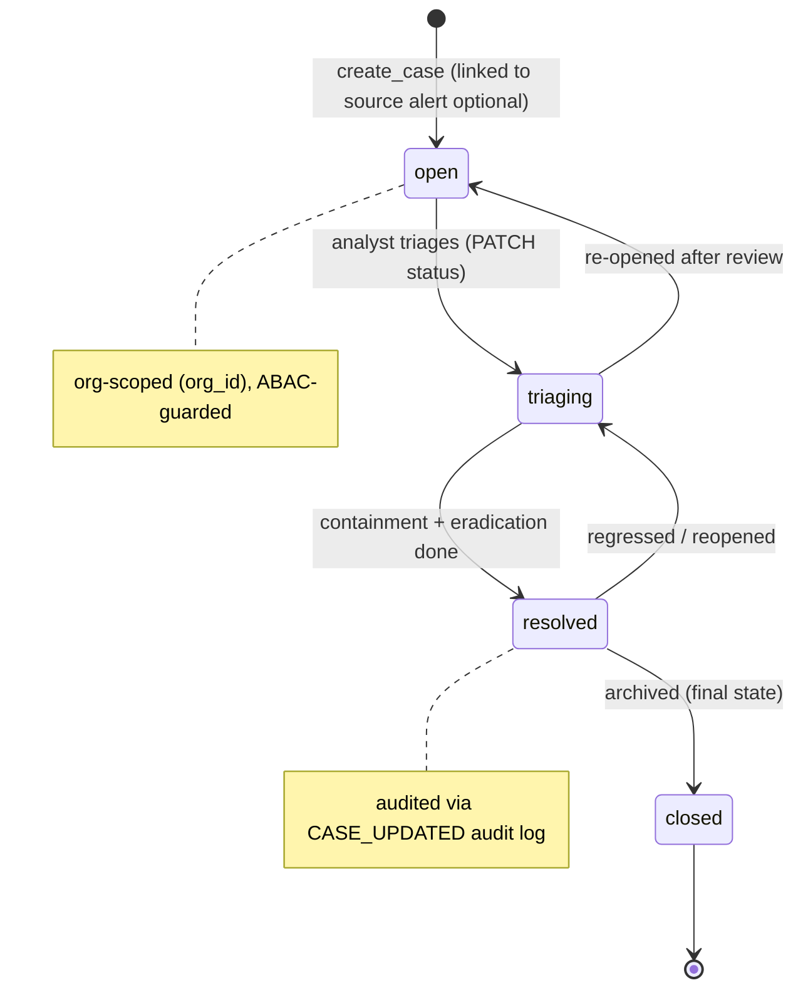

# State Diagram — Alert & Incident Lifecycle

> UML **State Machine Diagram** (behavioral) for the two key stateful entities:
> the persisted upload `ScanBatch` and the incident `Case`.

## ScanBatch (upload job)

## Case (incident)

## State transitions enforced by `case_service`

| From | To | Trigger | ABAC permission |
| --- | --- | --- | --- |
| `open` | `triaging` | analyst assigns / starts work | `alerts:write` |
| `triaging` | `resolved` | containment complete | `alerts:write` |
| `resolved` | `triaging` | regression detected | `alerts:write` |
| `resolved` | `closed` | archival (final) | `alerts:write` |
| any | any | invalid transition | rejected (`ValueError` → 400) |

> **Current state:** `ScanBatch.status` transitions are implemented in
> `alert_service.process_batch`; `Case.status` transitions are implemented in
> `case_service.update_case` (valid set: `open | triaging | resolved | closed`).
