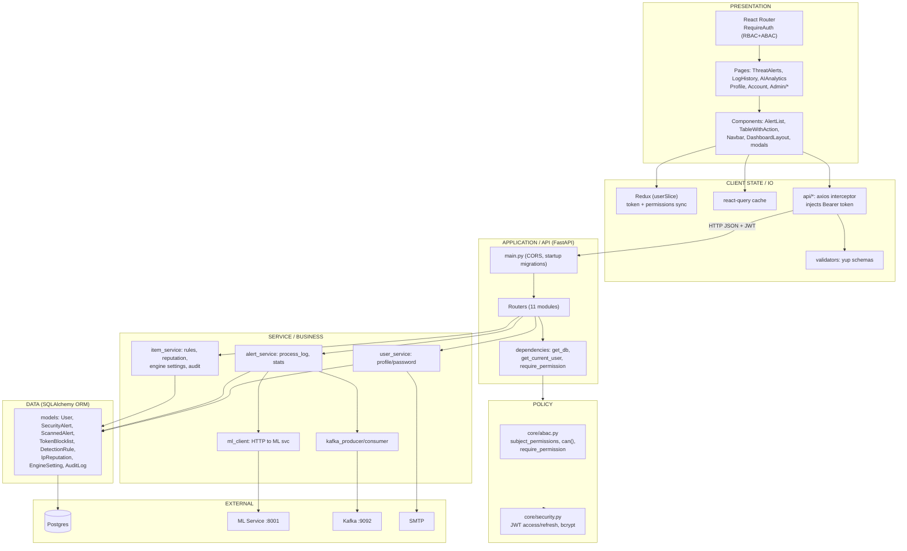

# System Architecture — Layered View

> UML **Architecture / Component** view of the application stack.

## Layer responsibilities

| Layer | Key files | Responsibility |
| --- | --- | --- |
| Presentation | `dashboard/src/{App,pages,features,layouts}/*` | Route/UI, permission-gated navigation |
| Client state/IO | `dashboard/src/{store,api,utils}/*` | Redux user state, axios JWT injection, query cache |
| Application/API | `backend/app/api/v1/*` | REST routes + dependency injection |
| Policy | `backend/app/core/{abac,security}.py` | ABAC decisions, JWT/bcrypt |
| Service | `backend/app/services/*` | Business logic, ML proxying, Kafka, audit |
| Data | `backend/app/models/*` | SQLAlchemy ORM mapped to Postgres |
| External | docker-compose services | Postgres, Kafka/Zookeeper, ML, SMTP |