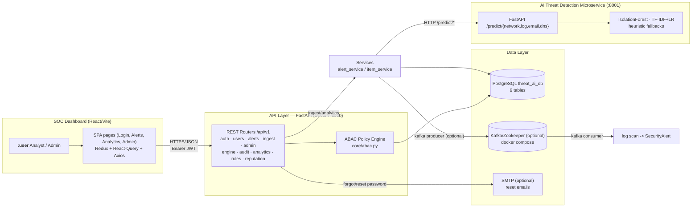

# System Design — Deployment Topology

> UML **Deployment / System Design** view of all services and how they connect.

## Notes

- **Running now:** backend uvicorn on `:8000`, dashboard Vite on `:3000`,
  PostgreSQL on `5432` (`threat_ai_db`).
- **Optional services:** ML service (`:8001`) and Kafka are opt-in. They are
  toggled via `ENABLE_KAFKA` in `backend/app/core/config.py`. When the ML
  service is unreachable, `ml_client.py` calls fail; the local heuristic
  fallbacks live *inside* the ML service itself.
- **Auth boundary:** every dashboard request carries a `Bearer <JWT>`; the
  backend validates it in `get_current_user` and then evaluates the ABAC policy
  for the route's required permission.