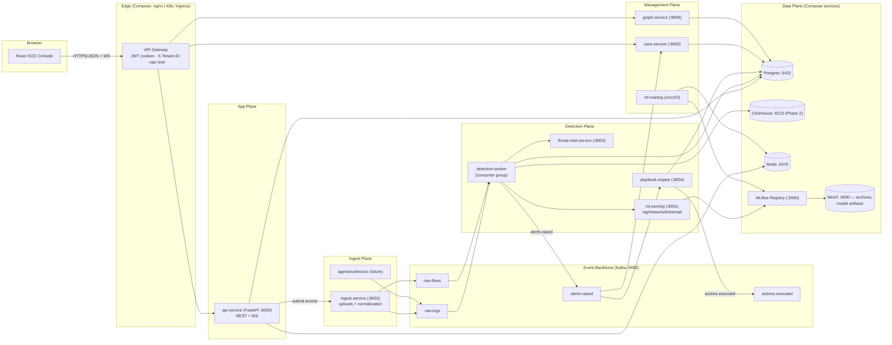
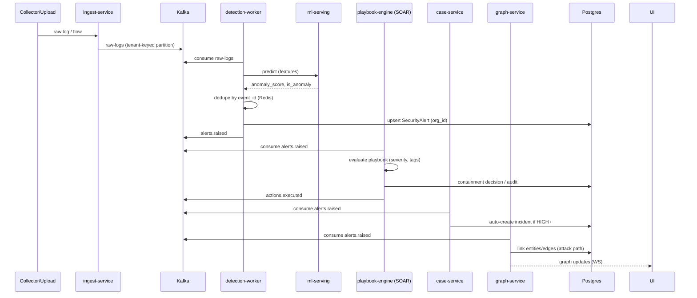

# Target System Design — Deployment Topology & Data Flow (v3)

> Deployment view of the restructured platform, mapped to **Docker Compose
> today → Kubernetes tomorrow**. All services expose `/health/live` +
> `/health/ready`; shared config via env + a small config service.

## Data flow — one alert end to end

## Multi-tenancy design

| Concern | Approach |
| --- | --- |
| Identity | JWT carries `user_id`, `org_id`, roles; tenant resolved at gateway |
| Data isolation | `org_id` on every tenant-owned table; **Postgres RLS** as defense-in-depth |
| Kafka | per-tenant routing key → partition locality; consumer groups per org where needed |
| UI | org-scoped menus; cross-tenant visibility only via admin service |
| Quotas | per-org rate limits + storage quotas in Redis/ClickHouse |

## K8s-readiness (built in from day one)

- All services = **stateless 12-factor** containers (state only in data plane).
- Config via env; secrets via K8s Secrets (Vault later).
- Liveness/readiness probes on every service.
- Horizontal scaling: API/detection/ingest scale via replicas; Kafka partitions
  set accordingly.
- Observability: structured logs + `X-Request-ID`, metrics (Prometheus) and
  tracing (OpenTelemetry) added in Phase 2.
- Helm chart / Kustomize manifests land in `deploy/k8s`.

## Migration phases

| Phase | Scope | Deliverable |
| --- | --- | --- |
| **1 — Event backbone + multi-tenant core** | Kafka producers/consumers, ingest-service, detection-worker, `org_id` model + RLS, cases, threat-intel, ATT&CK tags | Compose runs; monolith split; tests green |
| **2 — Analytics + automation + graphs** | ClickHouse, SOAR playbooks + adapters, Neo4j graph, MLflow registry + feature store | Real-time dashboards, auto-containment, attack graphs |
| **3 — K8s** | Helm/Kustomize, HPA, OpenTelemetry, managed Kafka/Postgres/Redis | Production rollout |

## What stays vs what changes

| Aspect | Current (v2) | Target (v3) |
| --- | --- | --- |
| Dashboard | React + Redux | Same, + Graph Explorer, Cases UI, WS live feed |
| Backend | FastAPI monolith (`backend/`) | API service + ingest + detection + case + graph + intel + SOAR |
| Eventing | optional Kafka flag | Kafka = mandatory backbone |
| Log analytics | Postgres only | ClickHouse for long-term/trends |
| ML | heuristics + trained models in one svc | train/serve separated, versioned, feature store |
| Tenancy | single-tenant | multi-tenant `org_id` + RLS |
| Auth | JWT + ABAC | JWT(cookies) + ABAC, tenant-scoped |
| Rules | DetectionRule table | Rules + SOAR playbooks + ATT&CK mapper |
