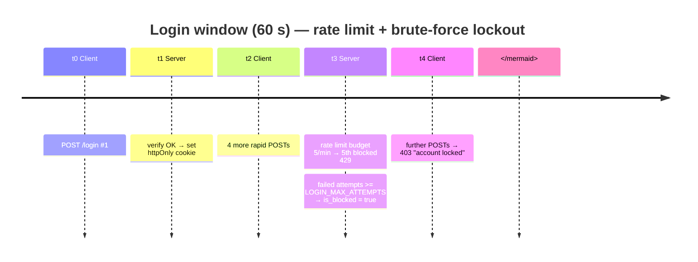
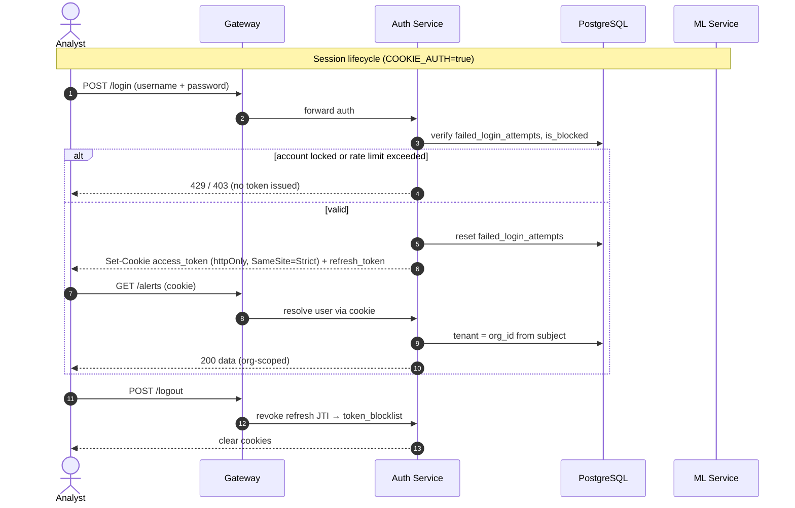

# Timing Diagram — Login, Rate Limit & Session Lifecycle

> UML **Timing Diagram** (behavioral) for the v3 auth hardening: login
> rate-limiting, brute-force lockout, cookie session refresh, and token
> revocation. Time flows left → right; state bands show each subject's state.

## Login attempt window (rate limit + lockout)

## State lifelines over time

## Timing bands

| Band | Initial state | Trigger | New state |
| --- | --- | --- | --- |
| Auth session | anonymous | `POST /login` OK | authenticated (cookie) |
| Rate-limit budget | 5/min | each login POST | -1; resets after 60 s |
| Account lockout | `is_blocked=False` | ≥ `LOGIN_MAX_ATTEMPTS` failures | `is_blocked=True` |
| Refresh token | valid | expiry / `/refresh` | rotated (new JTI) |
| Token blocklist | empty | `POST /logout` | JTI revoked until expiry |
| ML fallback | healthy call | 2 retries exhausted | heuristic prediction |

> **Current state:** login rate limit + lockout (`login_limiter`,
> `failed_login_attempts`, `is_blocked`), httpOnly cookie auth with
> `SameSite=Strict`, refresh-token JTI revocation, and the ML retry→heuristic
> fallback are all implemented.