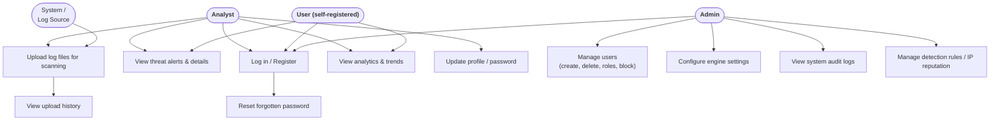

# Use Case Diagram — SOC Console

> UML **Use Case Diagram** of the functional requirements.

## ABAC enforcement per use case

| Use case | Backend permission gate | Notes |
| --- | --- | --- |
| Login / Register | public (`/login`, `/register`) | self-registration capped at `USER`/`ANALYST`; ADMIN rejected |
| Reset password | public (`/forgot-password`, `/reset-password`) | purpose-validated JWT; dev `reset_link` when SMTP off |
| View alerts | `get_current_user` (auth) | `alerts:read` implicit for all roles |
| Upload logs | `get_current_user` | ANALYST + ADMIN |
| View analytics | `get_current_user` | all roles |
| Manage users | `users:read/write/manage` | read/write = ADMIN; clean/delete = `users:manage` |
| Engine settings | `engine:read` (GET) / `engine:update` (PUT) | update needs clearance ≥ 4 (ADMIN) |
| Audit logs | `audit:read` | needs clearance ≥ 4 (ADMIN) |
| Rules / reputation | `rules:read`, `rules:write`, `rules:delete`; `reputation:read/write/block` | write/block need clearance ≥ 3 |

> All `require_permission` dependencies live in `backend/app/core/abac.py`; the
> permission catalog is `PERMISSIONS`, role base-sets are `ROLE_PERMISSIONS`,
> and clearance thresholds are `CLEARANCE_REQUIREMENTS`.