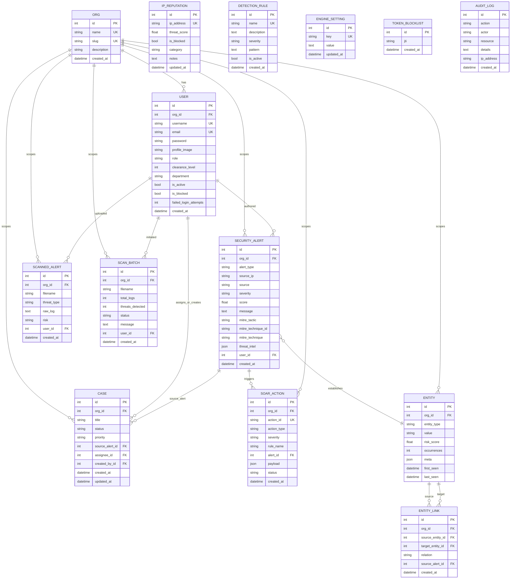

# Database Design

**System:** AI-Enhanced Cybersecurity Threat Detector (v3 target)
**Document type:** Physical + Logical schema, normalization analysis

Covers the relational store (PostgreSQL in production, SQLite in tests). Kafka is
the event backbone and is *not* a persistence store — the DB is the source of
truth for alerts, cases, users, orgs, and audit.

---

## 1. Entity-Relationship Diagram (logical)

> **Design decisions:** `IpReputation` enriches *by value* (referenced by
> `source_ip` string) rather than an FK, because reputation is keyed on the IP
> address (a natural key) and alerts should keep a stable snapshot even if the
> reputation record later changes. The enrichment copy is stored in the alert's
> `threat_intel` JSON. `AuditLog.actor` is likewise a snapshot string, not an FK,
> so the trail survives user deletion/renaming. `DetectionRule` and
> `EngineSetting` relate to alerts *conceptually* (they tune the engine) with no
> FK, so those ERD links are logical only. `TokenBlocklist` stores the revoked
> `jti` (no FK to users) so tokens stay revocable even if the account is gone.

## 2. Table catalog

| Table | Purpose | FKs | Uniques / indexes |
| --- | --- | --- | --- |
| `orgs` | tenants | — | `name`, `slug` unique |
| `users` | subjects (ABAC attrs) | `org_id` | `username`, `email` unique |
| `security_alerts` | operational alert feed | `org_id`, `user_id` | idx `org_id`, `created_at` |
| `scanned_alerts` | uploaded-file evidence rows | `org_id`, `user_id` | idx `org_id` |
| `scan_batches` | upload session history | `org_id`, `user_id` | idx `org_id` |
| `cases` | incidents | `org_id`, `source_alert_id`, `assignee_id`, `created_by_id` | idx `org_id`, `status` |
| `entities` | normalized threat indicators (attack-graph nodes) | `org_id` | unique `(org_id, entity_type, value)` |
| `entity_links` | attack-graph edges | `org_id`, `source_entity_id`, `target_entity_id`, `source_alert_id` | idx `org_id`, both entity FKs |
| `soar_actions` | automated response audit records | `org_id`, `alert_id` | `action_id` unique; idx `(org_id, created_at)` |
| `ip_reputation` | IP scoring + blacklist | — | `ip_address` unique |
| `detection_rules` | signature rules | — | `name` unique |
| `engine_settings` | key/value config | — | `key` unique |
| `token_blocklist` | revoked refresh JTIs | — | idx `jti` |
| `audit_logs` | append-only trail | — (actor is a snapshot string) | idx `created_at` |

## 3. Normalization analysis

All tables are designed to **BCNF**. Walkthrough per table:

### 3.1 `orgs`
- **1NF:** single-valued atomic columns (`name`, `slug`); no arrays/repeating groups. ✔
- **2NF:** PK is a single column (`id`) → no partial-key dependencies. ✔
- **3NF:** every non-key column (`name`, `slug`) is fully functionally dependent on the PK and transitively independent. ✔
- **BCNF:** only candidate key is `id` (also `slug` is a candidate key, neither is a superkey-left-hand-side of a non-trivial FD over another). No redundancy. ✔

### 3.2 `users`
- **1NF:** atomic columns. ✔
- **2NF:** PK `id` single column. ✔
- **3NF:** `role`, `clearance_level`, `department`, `org_id` etc. all depend only on `id`. `org_id` is an FK to `orgs` (dependency stored separately in parent), so no transitive dependency on a non-key. ✔
- **BCNF:** only FD is `id → attrs`; no non-trivial FD with a non-candidate-key LHS. ✔

### 3.3 `security_alerts`
- **1NF:** atomic columns, `threat_intel` is a **self-contained JSON value** (a single atomic attribute at the logical level — not a repeating group; normalization treats a whole document as atomic since no subfield is queried relationally). ✔
- **2NF / 3NF:** PK `id`; all attributes (severity, score, MITRE, org_id) depend on the alert's identity only. ✔
- **BCNF:** ✔ — the mitigation of repeating source details is exactly what `threat_intel` avoids: instead of duplicating reputation rows per alert, it stores a snapshot.

### 3.4 `cases`
- **1NF:** ✔
- **2NF:** PK `id`. ✔
- **3NF:** `assignee_id`/`created_by_id` are FKs to `users`; `source_alert_id` FK to alerts — no non-key column depends on another non-key column. ✔
- **BCNF:** ✔

### 3.5 `scan_batches` / `scanned_alerts`
- One upload session = one `scan_batches` row (header) + many `scanned_alerts` (details) — a clean **1NF parent-child** split that removes repeating groups. ✔ 2NF/3NF/BCNF hold by the same single-column-PK argument. ✔

### 3.6 Lookup / config tables
`ip_reputation`, `detection_rules`, `engine_settings`, `token_blocklist`, `audit_logs`, `soar_actions` — all single-column-PK, no partial or transitive dependencies. ✔ **BCNF** everywhere. ✔

### 3.7 `entities` / `entity_links` (attack graph)
- **1NF:** nodes have atomic columns (`value`, `entity_type`); the graph is normalized into **two tables** (nodes + edges) instead of storing adjacency arrays — no repeating groups. ✔
- **2NF / 3NF:** `entities` PK is `id`, so no partial dependency; `risk_score`/`occurrences`/`meta` all depend on the entity identity only. `entity_links` PK is `id`; `relation` and the two FKs depend on the link identity only. The **unique constraint `(org_id, entity_type, value)`** is a candidate key merely applying the identity — the LHS is a superkey, so BCNF holds. ✔
- **BCNF:** the only non-trivial FDs have candidate keys on the left (`id → *`, `(org_id, entity_type, value) → *`). No redundancy. ✔

### 3.8 `soar_actions`
- **1NF:** atomic columns; `payload` is a self-contained JSON document (atomic at the logical level). ✔
- **2NF / 3NF:** PK `id`; `action_id` unique on the same row (no transitive chain off a non-key). ✔
- **BCNF:** ✔

## 4. Why BCNF (and not stop at 3NF)

- No non-trivial functional dependency has a non-candidate-key left-hand side.
- Example: in `security_alerts`, `source_ip → (mitre?)` is **not** modeled as a dependency — MITRE is computed from the *message* content, not the IP, so no violation is introduced.
- `audit_logs` stores `actor` as a value snapshot rather than an FK to `users`, because an audit trail must be immutable even if the user row is later deleted/renamed. This is a deliberate denormalization-by-snapshot that keeps BCNF (the `actor` string has no other non-key dependencies).

## 5. Indexing strategy (NFR-SCAL-02)

- **All tenant-owned tables:** index on `org_id` → every query is pre-filtered by tenant.
- **`security_alerts`:** composite `(org_id, created_at DESC)` for the paginated feed.
- **`ip_reputation`:** unique `ip_address` (natural key lookup in threat-intel).
- **`audit_logs`:** index on `created_at` for the ordered audit feed.
- **`token_blocklist`:** index on `jti` for O(1) revocation checks.
