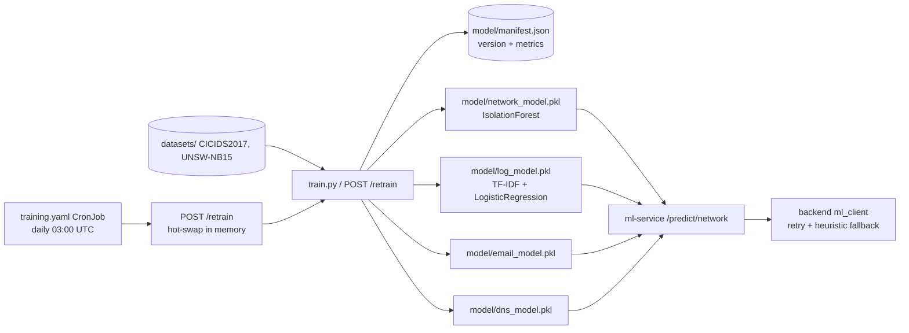

# ML Training → Serving Pipeline (v3)

Describes how models are trained, versioned, and served by the ML microservice.
Addresses **FR-STREAM-05** (training-serving pipeline) and **NFR-PORT-04**
(interoperable event/topic contract).

## Current pipeline (implemented)

- **Training:** `ml-service/app/training.py` fits models and writes `.pkl` artifacts
  plus a versioned `manifest.json` (version, trained-at, per-model status/metrics).
  The `train.py` CLI requires the CICIDS datasets; the in-service `POST /retrain`
  endpoint skips the network model gracefully when data is not mounted
  (`require_network=false`, status `skipped`).
- **Scheduled retraining (FR-STREAM-05 runtime):** `k8s/training.yaml` is a daily
  CronJob that triggers `POST /retrain`; the endpoint trains and **hot-swaps**
  the in-memory models via `network/log/email_model.reload()` so the next
  predictions use the new artifacts with no pod restart. `concurrencyPolicy:
  Forbid` prevents overlaps.
- **Versioning:** every run records `manifest.json`; `GET /models` returns it
  so the backend can log which model version scored each alert.
- **Serving:** `ml-service/app/main.py` exposes `POST /predict/{network|log|email|dns}`
  (+ `/detail` and `/batch` variants), `GET /models`, `GET /health`.
- **Consumption:** the backend's `ml_client` retries (2×, 0.3/0.6 s backoff)
  and falls back to heuristics with `fallback: True` when the service is down.
- **Contract tests:** `backend/tests/contract/test_ml_contract.py` pins the
  request/response shape between backend and ml-service.

## Target pipeline (v3 — K8s, train/serve split)

| Stage | Current | v3 target |
| --- | --- | --- |
| Data | local `datasets/` CSVs | versioned dataset bucket / volume |
| Training | `train.py` CLI + `POST /retrain` + daily CronJob | CI job or training CronJob emitting versioned artifacts |
| Artifacts | `.pkl` files + `manifest.json` (in-container FS) | object storage / PVC + model registry (metadata, checksum, metric) |
| Serving | single container loading all 4 models | per-model Deployment + HPA (see `k8s/ml-service.yaml`) |
| Rolling update | replace container image | canary/rolling via new artifact version + `GET /models` refresh |
| Retraining trigger | scheduled (CronJob) + manual | on alert-feedback threshold or scheduled pipeline |

## Versioning & release contract

1. Training run produces `{model}.pkl` + `{model}.json` manifest
   (model name, version, trained-at, f1/auc, feature list, data hash).
2. `GET /models` returns the active manifest so the backend can log which model
   version scored each alert (auditability for SOC).
3. A new artifact is rolled out by mounting the new version; `/health` gates the
   readiness probe.

## Feature contract (shared with backend)

The backend sends the same JSON shapes the training/feature-extraction code
expects:

- **network:** `bytes`, `duration`, plus the `NETWORK_FEATURES` columns from
  `train.py` (feature extractor in `feature_extractor.py`).
- **log:** `message`/`content` text → TF-IDF vectorized.
- **email:** sender/subject/body heuristics → phishing score.
- **dns:** domain entropy/blacklist features → threat score.

Changes to this contract must update `ml-service/app/feature_extractor.py`,
`train.py`, and `backend/tests/contract/test_ml_contract.py` together.
